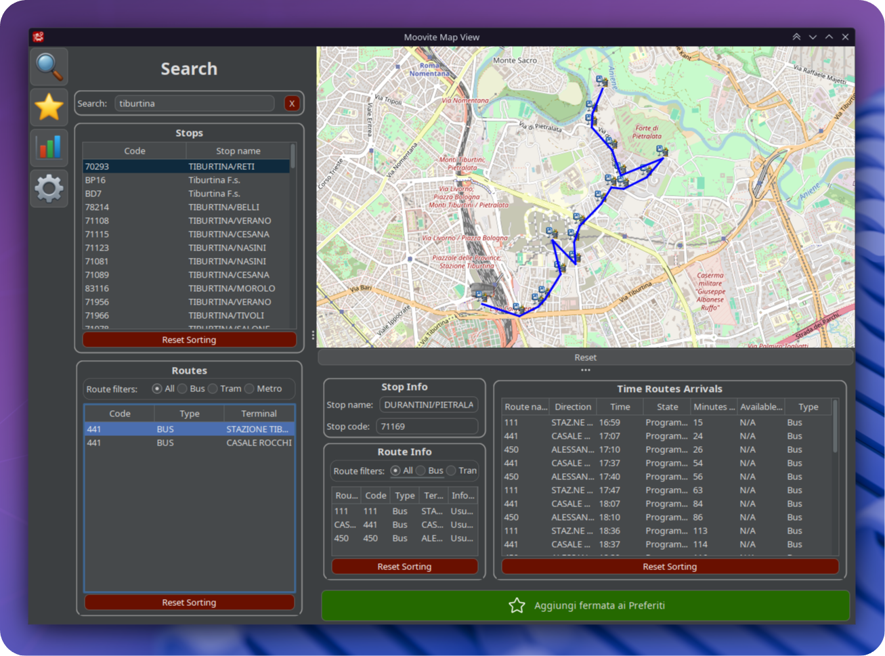

# Moovite


**Real-time transit tracking for Rome's public transport system**  
*Nnamo Inc.*

Track buses, view live arrivals, and navigate Rome's transit network with real-time GTFS data from Roma Mobilità.



## What it does

Moovite connects to Rome's live transit feeds to show you:
- Where buses are right now on the map
- When your bus will actually arrive (not just the schedule)
- Route paths with live vehicle positions
- System-wide statistics and performance metrics

The app processes GTFS (General Transit Feed Specification) data every 30 seconds to keep everything current.

## Main features

 **Search** - Find stops and routes by name. The search is fuzzy, so typing "termini" will find "Roma Termini" and similar stops.

 **Stop details** - Click any stop to see live departure times, delays, and which routes pass through it.

 **Favorites** - Save stops you use regularly. They'll show up on the favorites menu for quick access.

 **Statistics** - System-wide metrics like how many buses are currently stopped, delayed, or running smoothly.

 **Real-time toggle** - Switch between live data and static schedules. Useful when the real-time feeds are down.

## Running the app

### Download and run
Get the latest release from the [releases page](https://github.com/nnamo-inc/moovite/releases):
- **Windows**: Download `moovite-windows.exe` and run it
- **Linux**: Download `moovite-linux`, make it executable, and run it
- **Any platform**: Download the `.jar` file and run `java -jar moovite-1.0-SNAPSHOT.jar`

*Requires Java 21+ for the JAR version*

### Build from source
```bash
git clone https://github.com/nnamo-inc/moovite.git
cd moovite
make compile
make run
```

## How to use it

1. **Search**: Type a stop name or route number in the search bar
2. **Select**: Click on a stop to see live departure times  
3. **Explore**: Click on routes to see the full path with live buses
4. **Track**: Watch vehicles move in real-time on the interactive map
5. **Analyze**: Check the statistics panel for system performance

The interface shows delays in red when buses are late, and quality indicators help you choose the best routes.

## Technical details

Built with Java 21, using:
- **SQLite** for local GTFS data storage
- **GTFS Protocol Buffers** for real-time feed processing
- **Swing + FlatLaf** for the interface
- **JXMapViewer** for the interactive map
- **ORMLite** for database operations

The app continuously processes updates with live vehicle positions and trip updates.

## Development

### Running locally
```bash
mvn clean compile exec:java -Dexec.mainClass="com.nnamo.App"
```

### Documentation
- **JavaDoc**: Run `mvn javadoc:javadoc` or visit [https://nnamo-inc.github.io/moovite/](https://nnamo-inc.github.io/moovite/)

### Releases

**For stable versions:**
```bash
git tag v1.0.0
git push origin v1.0.0
```

**For development builds:**  
Just push to `main` - the CI automatically creates snapshot releases.

The GitHub Actions workflow builds native binaries for Windows and Linux, plus a cross-platform JAR. Documentation gets deployed to GitHub Pages automatically.

---

**Team**: Samuele Lombardi, Riccardo Finocchiaro, Davide Galilei
